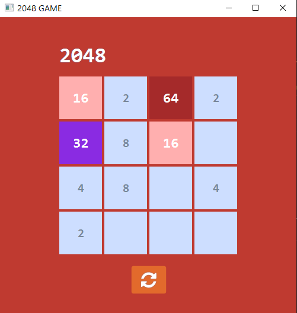

# 2048 Game using JavaFX
### This is a Simple 2048 Game, build by javaFx.
## Table of contents

- [Overview](#overview)
    - [The challenge](#the-challenge)
    - [Screenshot](#screenshot)
- [My process](#my-process)
    - [Built with](#built-with)
    - [What I learned](#what-i-learned)
    - [Continued development](#continued-development)

## Overview
- Here I build Famous 2048 Game by JavaFx and along with few css properties.
### The challenge

- To create 2048 game by understanding the OOP concepts and working with JavaFx for GUI part. 
### Screenshot

## My process

### Built with

- Java
- JavaFx
- CSS
- [Styled Components](https://styled-components.com/) - For styles

### What I learned

- By building this i understand the OOP concepts in Java and How the GUI part is build using JavaFx.

### Continued development

    Will do more User end options for easy Handling Purpose.
